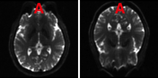

## About

`dcm_qa_polar` is a DICOM to NIfTI validator script and dataset to test conversion of GE DICOM datasets to the NIfTI format. Specifically, these scan illustrate `epi_pepolar` research sequence, where some image have reversed row order (making them appear flipped in tools that assume the DICOM spatial transform is truthful).

Echo Planar Imaging (EPI) provides rapid scans, but the images are inherently distorted. Tools like [TOPUP](https://fsl.fmrib.ox.ac.uk/fsl/fslwiki/topup/TopupUsersGuide) can undistort spin echo EPI scans based on pairs of images where the phase encoding polarity is reversed. Since these volumes have spatial distortion of equal magnitude but opposite direction, one can infer the actual shape (the midpoint between the two distorted locations).

GE users often use a special `epi_pepolar` sequence to acquire these polarity reversed images. In the default mode, both polarities are acquired in a single series. Atypically, those with reverse phase encoding polarity are stored with reversed row order, but no other changes in the DICOM header. The image below illustrates how these images appear when viewed with a tool that assumes the DICOM header is truthful. Here the axial scans have anterior-posterior phase encoding. You can see that the two volumes have different spatial distortions, with the phase reversed image appearing upside down (right panel, with `A` indicating the reported anterior direction).

These scans can be detected based on the private tag PulseSequenceName (0019,109C) including the string `epi_pepolar` and the number stored in private tag UserData12 (0019,10B3) stores the mode for this sequence (0=fwd; 1=rev; 2=rev-fwd; 3=fwd-rev). So for the default mode (2), all odd volumes are phase reversed.

dcm2niix (from v1.0.20210814) will flip the row order and the polarity of the [BIDS](https://bids-specification.readthedocs.io/en/stable/04-modality-specific-files/01-magnetic-resonance-imaging-data.html) `PhaseEncodingDirection` (so the spatial information is correct) for reversed polarity scans. For modes where both forward and reverse phase encoding (2,3) is acquired in a single series, volumes with reversed phase encoding will have series number incremented by 1000 (segmenting phase encoding polarities into separate files, as required by the BIDS standard). 

Note that there are two popular ways to correct EPI data. [TOPUP](https://fsl.fmrib.ox.ac.uk/fsl/fslwiki/topup/TopupUsersGuide) requires phase-reversed spin echo scans, while [FUGUE](https://fsl.fmrib.ox.ac.uk/fsl/fslwiki/FUGUE/Guide) uses a gradient echo fieldmap. The TOPUP approach is a natural fit for spin echo diffusion-weighted images. One could use either approach for gradient echo functional/resting state sequences.

## DataSets

All data was acquired GE SIGNA ultra-high performance (UHP) 3.0T scanner. Images provided by Scott Peltier and Krisanne Litinas at the University of Michigan.

* `6_FM_cv12_2_3mm`
  * CV12 mode 2 (default rev-fwd).

* `7_FM_cv12_1_3mm`
  * CV12 mode 1 (rev).

* `8_FM_cv12_3_3mm`
  * CV12 mode 3 (fwd-rev).

* `9_FM_cv12_0_3mm`
  * CV12 mode 0 (fwd).

## Usage

You can run the script `batch.sh` from the Linux/macOS command line. It will use your installed version of [dcm2niix](https://github.com/rordenlab/dcm2niix) to convert the provided DICOM images to NIfTI format and will check that the results match the expected solution in the `ref` folder.

## Links

 * For details on GE scans and links to sample images see [dcm_qa_ge](https://github.com/rordenlab/dcm2niix/tree/master/GE).
 * Details regarding the dcm2niix kludge for ``epi_pepolar` sequences is described in [issue532](https://github.com/rordenlab/dcm2niix/issues/532).
